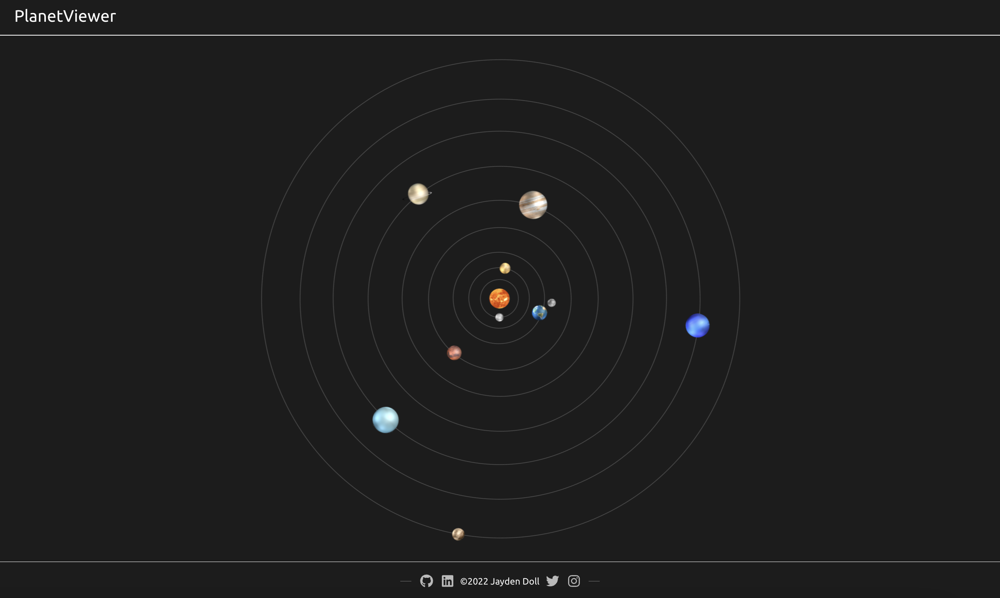
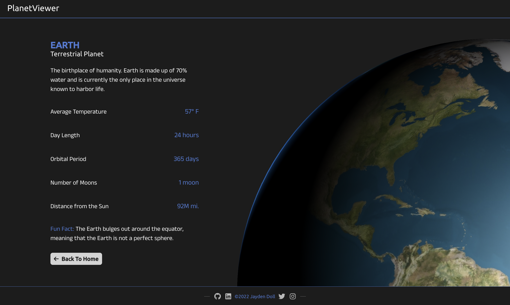
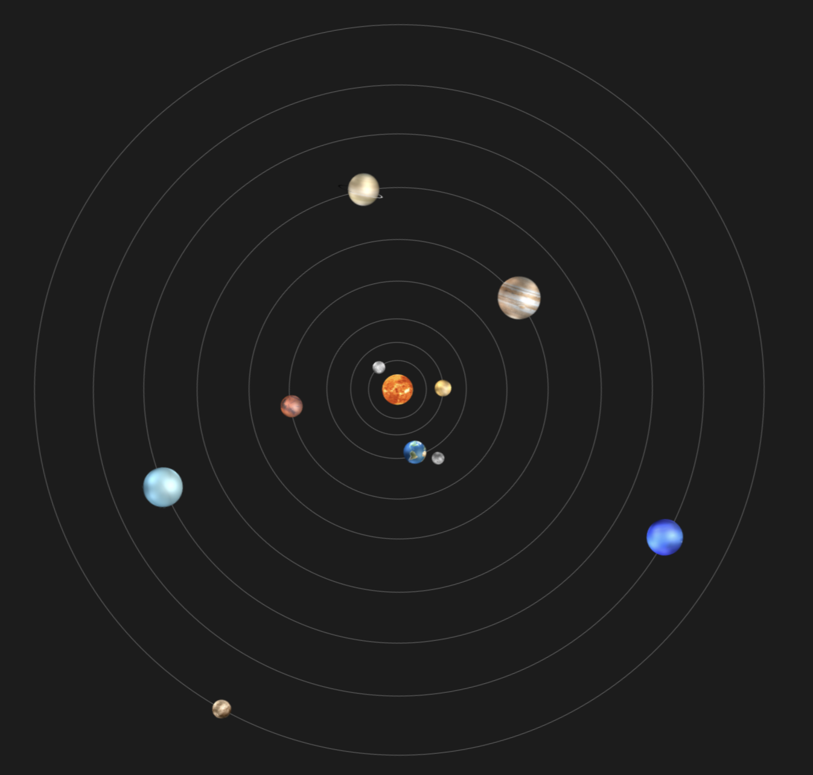
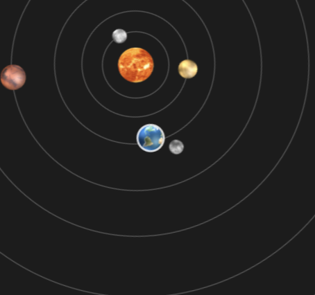
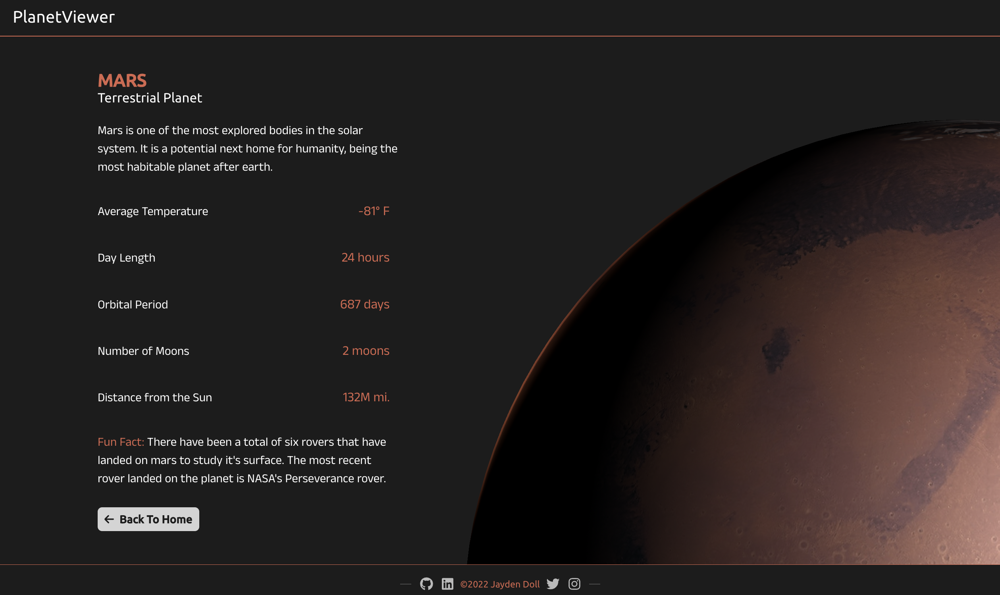

# PlanetViewer

Welcome to PlanetViewer, a simple, yet interactive way to learn amazing facts about the planets in our solar system!

<a href="https://planet-viewer3d.netlify.app/" target="_blank">🌎 Check it out here!</a>

---

_PlanetViewer Home Page_

_PlanetViewer Earth Page_

---

## Features

**-Rotating solar system diagram with all the planets** (yes, including pluto)

**-Interactive diagram** (clickable, showing hover)

**-Info page for each planet with it's own data and accent color styling** (planet page for mars)

**-High-quality 3D renders of each planet** (can be interacted with by moving the cursor around the planet)

---

### Other Features:

**-Smooth page transition animations**

**-Planet info pulled from custom planet API endpoint**

**-Custom animated page loading icon**

---

## Technologies Used:

React

React Router

Styled Components

Framer Motion

---

## Design Programs Used:

Figma

Spline

---
